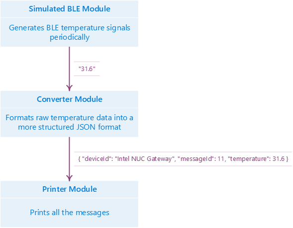

# Azure IoT Edge BLE Data Converter Module

## Overview

This tutorial showcases how one might build a [BLE](https://en.wikipedia.org/wiki/Bluetooth_Low_Energy) data converter module for Azure IoT Edge in Java.

In this tutorial, you will be guided on how to setup the environment, and how to write your module by using the latest Azure IoT Edge packages.

## Prerequisites

In this section, you will setup your system environment for the development of Azure IoT Edge module. It applies to both *64-bit Windows* and *64-bit Linux (Ubuntu)* operating systems.

First of all, the following softwares are required:

1. The latest [Git Client](https://https://git-scm.com/downloads).
2. The latest [**x64** JDK](http://www.oracle.com/technetwork/java/javase/downloads/jdk8-downloads-2133151.html).
3. The latest [Maven](https://maven.apache.org/install.html).

And now it's time to open your favorite command line terminal and navigate to the working folder:

1. `git clone https://github.com/Azure-Samples/iot-edge-samples.git`.
2. `cd iot-edge-samples/java/simulated_ble`

## Overall Architecture

The Azure IoT Edge heavily adopts the [Von Neumann architecture](https://en.wikipedia.org/wiki/Von_Neumann_architecture). That means the whole Azure IoT Edge is a system which processes input and produces output; and each individual module is also a tiny input-processor-output subsystem. In this tutorial, we'd like to introduce three modules:

1. A module which generates a simulated [BLE](https://en.wikipedia.org/wiki/Bluetooth_Low_Energy) signal periodically
2. A module which converts the received [BLE](https://en.wikipedia.org/wiki/Bluetooth_Low_Energy) signal to a formatted [JSON](https://en.wikipedia.org/wiki/JSON) message
3. A module which prints the received [JSON](https://en.wikipedia.org/wiki/JSON) message

So in this case, a typical end-to-end dataflow is illustrated below:




## Understand the Code

### Maven Project Structure

Since Azure IoT Edge packages are based on Maven, we need to create a typical Maven project structure, which contains a `pom.xml` file.

Ths POM inherits from the `com.microsoft.azure.gateway.gateway-module-base` package which declares all the dependencies needed by a module project like the runtime binaries, the gateway configuration file as well as the execution behaviors. So we do not need to write these hundreds lines of code again and again.

And the only essential thing we need to do in our own `pom.xml` is to re-declare the dependencies and plugins used in parent, and to specify the name of Azure IoT Edge configuration file. All other stuffs are just optional to Azure IoT Edge module development.

```xml
<project xmlns="http://maven.apache.org/POM/4.0.0"
         xmlns:xsi="http://www.w3.org/2001/XMLSchema-instance"
         xsi:schemaLocation="http://maven.apache.org/POM/4.0.0 http://maven.apache.org/xsd/maven-4.0.0.xsd">
  <modelVersion>4.0.0</modelVersion>

  <!-- Inherit from parent -->
  <parent>
    <groupId>com.microsoft.azure.gateway</groupId>
    <artifactId>gateway-module-base</artifactId>
    <version>1.0.1</version>
  </parent>
  
  <groupId>com.microsoft.azure.gateway</groupId>
  <artifactId>ble-converter</artifactId>
  <version>1.0</version>
  <packaging>jar</packaging>

  <!-- Set the filename of the Azure IoT Edge configuration located
       under ./src/main/resources/gateway/ which is used in parent -->
  <properties>
    <gw.config.fileName>gw-config.json</gw.config.fileName>
  </properties>

  <!-- Re-declare dependencies used in parent -->
  <dependencies>
    <dependency>
      <groupId>com.microsoft.azure.gateway</groupId>
      <artifactId>gateway-java-binding</artifactId>
    </dependency>
    <dependency>
      <groupId>${dependency.runtime.group}</groupId>
      <artifactId>${dependency.runtime.name}</artifactId>
    </dependency>
  </dependencies>

  <!-- Re-declare plugins used in parent -->
  <build>
    <plugins>
      <plugin>
        <groupId>org.apache.maven.plugins</groupId>
        <artifactId>maven-dependency-plugin</artifactId>
      </plugin>
      <plugin>
        <groupId>org.apache.maven.plugins</groupId>
        <artifactId>maven-resources-plugin</artifactId>
      </plugin>
      <plugin>
        <groupId>org.apache.maven.plugins</groupId>
        <artifactId>maven-shade-plugin</artifactId>
      </plugin>
      <plugin>
        <groupId>org.codehaus.mojo</groupId>
        <artifactId>exec-maven-plugin</artifactId>
      </plugin>
    </plugins>
  </build>
</project>
```

### Basic Knowledge of Module

You could simply treat a Module of Azure IoT Edge as a data processor whose job is to: receive input, process it, and produce output.

The input might be the data from another hardware (like a motion detector), the message from other modules, or anything of your own (like a random number generated periodically by a timer).

The output is similar to the input, it could be triggering some hardware behaviors (like the blinking LED), a message to other modules, or anything of your own (like printing to the console).

Modules communicate with each other using `com.microsoft.azure.gateway.messaging.Message` class. The **Content** of a `Message` is a byte array which is capable of representing any kind of data you like. **Properties** is also available in `Message`, it is simply a string-to-string map. You may think Properties as the headers in HTTP request, or the metadata of a file.

In order to develop an Azure IoT Edge module in Java, you need to create a new module class which extends from `com.microsoft.azure.gateway.core.GatewayModule`. Then you need to implement the abstract methods like `receive()` and `destroy()`. You can also choose to implement the optional methods like `start()` or `create()`. The following piece of code is a skeleton of writing a module.

```java
import com.microsoft.azure.gateway.core.Broker;
import com.microsoft.azure.gateway.core.GatewayModule;
import com.microsoft.azure.gateway.messaging.Message;

public class MyEdgeModule extends GatewayModule {
  public MyEdgeModule(long address, Broker broker, String configuration) {
    /* Let the GatewayModule do the dirty work of initialization. It's also
       a good time to parse your own configuration defined in Azure IoT Edge
       configuration file (typically ./src/main/resources/gateway/gw-config.json) */
    super(address, broker, configuration);
  }

  @Override
  public void start() {
    /* Acquire the resources you need. If you don't
       need any resources, you may omit this method. */
  }

  @Override
  public void destroy() {
    /* It's time to release all resources. This method is required. */
  }

  @Override
  public void receive(Message message) {
    /* Logic to process the input message. This method is required. */
    // ...
    /* Use publish() method to do the output. You are
       allowed to publish your new Message instance. */
    this.publish(message);
  }
}
```

### Simulated BLE Module

| Input | Processor | Output                   | Source File               |
| ----- | --------- | ------------------------ | ------------------------- |
| N/A   | N/A       | Temperature data message | `SimulatedBleModule.java` |

This module simulates a [BLE](https://en.wikipedia.org/wiki/Bluetooth_Low_Energy) temperature hardware. It uses its own [Timer](https://docs.oracle.com/javase/8/docs/api/java/util/Timer.html) to send a randomized temperature data at a fixed rate. It also encloses a MAC Address and source type in the message properties.

Both the rate and the MAC address are coming from the module configuration string (typically it is a JSON string). That's why we need to first parse the configuration in the constructor of our module:

```java
public SimulatedBleModule(long address, Broker broker, String configuration) {
  super(address, broker, configuration);
  JSONObject bleConfig = new JSONObject(configuration);
  this.macAddress = bleConfig.getString("macAddress");
  this.messagePeriod = bleConfig.getInt("messagePeriod");
}
```

And when the module is started, a timer need to be created to send a temperature data. And we do not need to release any resources (including the timer) because we make our timer to be a [daemon](https://docs.oracle.com/javase/8/docs/api/java/lang/Thread.html#setDaemon-boolean-).

```java
@Override
public void start() {
  new Timer(true).schedule(new TimerTask() {
    private Random rand = new Random();

    @Override
    public void run() {
      try {
        HashMap<String, String> properties = new HashMap<>();
        properties.put("source", "bleTelemetry");
        properties.put("macAddress", SimulatedBleModule.this.macAddress);

        float temperature = this.rand.nextFloat() * 20 + 20;
        byte[] content = Float.toString(temperature).getBytes();
        
        SimulatedBleModule.this.publish(new Message(content, properties));
      } catch (Exception e) {
        e.printStackTrace();
      }
    }
  }, 0, this.messagePeriod);
}
```

### Converter Module

| Input                    | Processor                              | Output                 | Source File            |
| ------------------------ | -------------------------------------- | ---------------------- | ---------------------- |
| Temperature data message | Parse and construct a new JSON message | Structure JSON message | `ConverterModule.java` |

This module is a typical Azure IoT Edge module. It accepts temperature message from any other modules (probably a hardware module, or in this case our simulated BLE module); and then it normalized the temperature message to a formal structured JSON message (including appending the message ID, setting the property of whether we need to trigger the temperature alert, and so on).

```java
@Override
public void receive(Message message) {
  try {
    float temperature = Float.parseFloat(new String(message.getContent()));
    Map<String, String> inputProperties = message.getProperties();

    HashMap<String, String> properties = new HashMap<>();
    properties.put("source", inputProperties.get("source"));
    properties.put("macAddress", inputProperties.get("macAddress"));
    properties.put("temperatureAlert", temperature > 30 ? "true" : "false");

    String content = String.format(
      "{ \"deviceId\": \"Intel NUC Gateway\", \"messageId\": %d, \"temperature\": %f }",
      ++this.messageCount, temperature);

    this.publish(new Message(content.getBytes(), properties));
  } catch (Exception ex) {
    ex.printStackTrace();
  }
}
```

### Printer Module

| Input                          | Processor | Output                     | Source File          |
| ------------------------------ | --------- | -------------------------- | -------------------- |
| Any message from other modules | N/A       | Log the message to console | `PrinterModule.java` |

This module is the simplest one among all the modules we create. Let's just show the code without explaining it.

```java
@Override
public void receive(Message message) {
  System.out.println(message.toString());
}
```

### Azure IoT Edge Configuration

The final step before running the modules is to configure the Azure IoT Edge and to establish the connections between modules.

First we need to declare our java loader (since Azure IoT Edge supports loaders of different languages) which could be referenced by its `name` in the sections afterward.

```json
"loaders": [{
  "type": "java",
  "name": "java",
  "configuration": {
    "jvm.options": {
      "library.path": "./"
    }
  }
}]
```

And our modules are also required to be declared. Similar to the loaders, they can also be referenced by the `name`. In the declaration of each module, we need to specify the loader (which should be the one we defined before) as well as the entry-point (should be the normalized class name of our module). Let's take the `SimulatedBleModule` as the example (sometimes even `args` is `null`, but you have to put it in the JSON file, otherwise it will cause the failure):

```json
"modules": [{
  "name": "ble",
  "loader": {
    "name": "java",
    "entrypoint": {
      "class.name": "com/microsoft/azure/gateway/SimulatedBleModule",
      "class.path": "./ble-converter-1.0-with-deps.jar"
    }
  },
  "args": {
    "macAddress": "01:02:03:03:02:01",
    "messagePeriod": 1000
  }
}]
```

At the end of the configuration, we establish the connections. Each connection is expressed by `source` and `sink`. They should both reference to a module defined before. And the output message of `source` module will be forwarded to the input of `sink` module.

```json
"links": [
  {
    "source": "ble",
    "sink": "converter"
  },
  {
    "source": "converter",
    "sink": "print"
  }
]
```

## Running the Modules

Use `mvn package` to build everything into the `target/` folder. `mvn clean package` is also recommended for a clean build.

Use `mvn exec:exec` to run the Azure IoT Edge and you should observe that the temperature data and all the properties are printed to the console at a fixed rate.

If you want to terminate the application, press `<Enter>` key.

> ⚠ **DO NOT** use Ctrl+C to terminate the IoT Edge, it might cause some side-effects.
